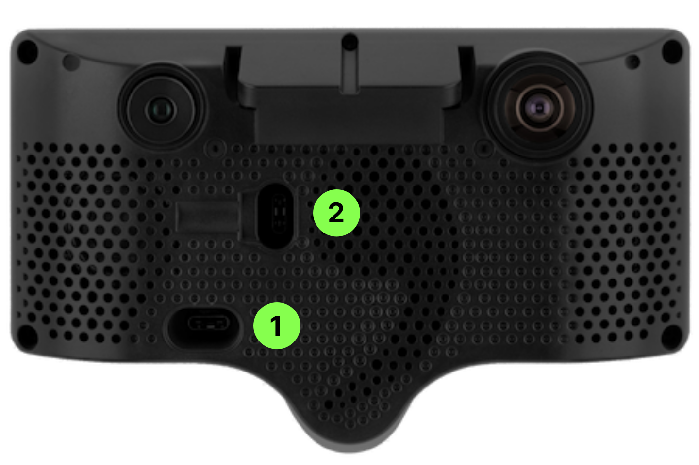

# connect to a comma 3/3X

A comma 3/3X is a normal [Linux](https://github.com/commaai/agnos-builder) computer that exposes [SSH](https://wiki.archlinux.org/title/Secure_Shell) and a [serial console](https://wiki.archlinux.org/title/Working_with_the_serial_console).

## Serial Console

On both the comma three and 3X, the serial console is accessible from the main OBD-C port.
Connect the comma 3/3X to your computer with a normal USB C cable, or use a [comma serial](https://comma.ai/shop/comma-serial) for steady 12V power.

On the comma three, the serial console is exposed through a UART-to-USB chip, and `tools/scripts/serial.sh` can be used to connect.

On the comma 3X, the serial console is accessible through the [panda](https://github.com/commaai/panda) using the `panda/tests/som_debug.sh` script.

  * Username: `comma`
  * Password: `comma`

## SSH

In order to SSH into your device, you'll need a GitHub account with SSH keys. See this [GitHub article](https://docs.github.com/en/github/authenticating-to-github/connecting-to-github-with-ssh) for getting your account setup with SSH keys.

* Enable SSH in your device's settings
* Enter your GitHub username in the device's settings
* Connect to your device
    * Username: `comma`
    * Port: `22`

Here's an example command for connecting to your device using its tethered connection:<br />
`ssh comma@192.168.43.1`

For doing development work on device, it's recommended to use [SSH agent forwarding](https://docs.github.com/en/developers/overview/using-ssh-agent-forwarding).


## ADB

In order to use ADB on your device, you'll need to perform the following steps using the image below for reference:



* Plug your device into constant power using port 2, letting the device boot up
* Enable ADB in your device's settings
* Plug in your device to your PC using port 1
* Connect to your device
    * `adb shell` over USB
    * `adb connect` over WiFi
    * Here's an example command for connecting to your device using its tethered connection: `adb connect 192.168.43.1:5555`

> [!NOTE]
> The default port for ADB is 5555 on the comma 3/3X.

For more info on ADB, see the [Android Debug Bridge (ADB) documentation](https://developer.android.com/tools/adb).

### Notes

The public keys are only fetched from your GitHub account once. In order to update your device's authorized keys, you'll need to re-enter your GitHub username.

The `id_rsa` key in this directory only works while your device is in the setup state with no software installed. After installation, that default key will be removed.

#### ssh.comma.ai proxy

With a [comma prime subscription](https://comma.ai/connect), you can SSH into your comma device from anywhere.

With the below SSH configuration, you can type `ssh comma-{dongleid}` to connect to your device through `ssh.comma.ai`.

```
Host comma-*
  Port 22
  User comma
  IdentityFile ~/.ssh/my_github_key
  ProxyCommand ssh %h@ssh.comma.ai -W %h:%p

Host ssh.comma.ai
  Hostname ssh.comma.ai
  Port 22
  IdentityFile ~/.ssh/my_github_key
```

### One-off connection

```
ssh -i ~/.ssh/my_github_key -o ProxyCommand="ssh -i ~/.ssh/my_github_key -W %h:%p -p %p %h@ssh.comma.ai" comma@ffffffffffffffff
```
(Replace `ffffffffffffffff` with your dongle_id)

### ssh.comma.ai host key fingerprint

```
Host key fingerprint is SHA256:X22GOmfjGb9J04IA2+egtdaJ7vW9Fbtmpz9/x8/W1X4
+---[RSA 4096]----+
|                 |
|                 |
|        .        |
|         +   o   |
|        S = + +..|
|         + @ = .=|
|        . B @ ++=|
|         o * B XE|
|         .o o OB/|
+----[SHA256]-----+
```
