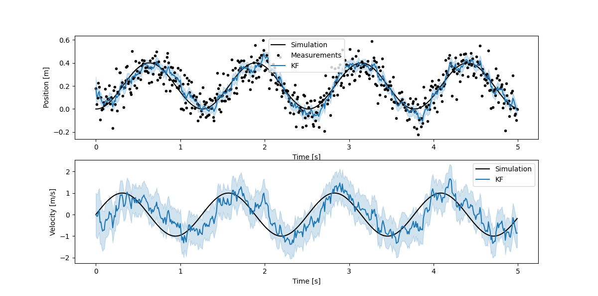

## Introduction
The kalman filter framework described here is an incredibly powerful tool for any optimization problem,
but particularly for visual odometry, sensor fusion localization or SLAM. It is designed to provide very
accurate results, work online or offline, be fairly computationally efficient, be easy to design filters with in
python.

## Feature walkthrough

### Extended Kalman Filter with symbolic Jacobian computation
Most dynamic systems can be described as a Hidden Markov Process. To estimate the state of such a system with noisy
measurements one can use a Recursive Bayesian estimator. For a linear Markov Process a regular linear Kalman filter is optimal.
Unfortunately, a lot of systems are non-linear. Extended Kalman Filters can model systems by linearizing the non-linear
system at every step, this provides a close to optimal estimator when the linearization is good enough. If the linearization
introduces too much noise, one can use an Iterated Extended Kalman Filter, Unscented Kalman Filter or a Particle Filter. For
most applications those estimators are overkill. They add a lot of complexity and require a lot of additional compute.

Conventionally Extended Kalman Filters are implemented by writing the system's dynamic equations and then manually symbolically
calculating the Jacobians for the linearization. For complex systems this is time consuming and very prone to calculation errors.
This library symbolically computes the Jacobians using sympy to simplify the system's definition and remove the possibility of introducing calculation errors.

### Error State Kalman Filter
3D localization algorithms usually also require estimating orientation of an object in 3D. Orientation is generally represented
with euler angles or quaternions.

Euler angles have several problems, there are multiple ways to represent the same orientation,
gimbal lock can cause the loss of a degree of freedom and lastly their behaviour is very non-linear when errors are large.
Quaternions with one strictly positive dimension don't suffer from these issues, but have another set of problems.
Quaternions need to be normalized otherwise they will grow unbounded, but this cannot be cleanly enforced in a kalman filter.
Most importantly though a quaternion has 4 dimensions, but only represents 3 degrees of freedom, so there is one redundant dimension.

Kalman filters are designed to minimize the error of the system's state. It is possible to have a kalman filter where state and the error of the state are represented in a different space. As long as there is an error function that can compute the error based on the true state and estimated state. It is problematic to have redundant dimensions in the error of the kalman filter, but not in the state. A good compromise then, is to use the quaternion to represent the system's attitude state and use euler angles to describe the error in attitude. This library supports and defining an arbitrary error that is in  a different space than the state. [Joan Solà](https://arxiv.org/abs/1711.02508) has written a comprehensive description of using ESKFs for robust 3D orientation estimation.

### Multi-State Constraint Kalman Filter
How do you integrate feature-based visual odometry with a Kalman filter? The problem is that one cannot write an observation equation for 2D feature observations in image space for a localization kalman filter. One needs to give the feature observation a depth so it has a 3D position, then one can write an obvervation equation in the kalman filter. This is possible by tracking the feature across frames and then estimating the depth. However, the solution is not that simple, the depth estimated by tracking the feature across frames depends on the location of the camera at those frames, and thus the state of the kalman filter. This creates a positive feedback loop where the kalman filter wrongly gains confidence in it's position because the feature position updates reinforce it.

The solution is to use an [MSCKF](http://citeseerx.ist.psu.edu/viewdoc/download?doi=10.1.1.437.1085&rep=rep1&type=pdf), which this library fully supports.

### Rauch–Tung–Striebel smoothing
When doing offline estimation with a kalman filter there can be an initialization period where states are badly estimated.
Global estimators don't suffer from this, to make our kalman filter competitive with global optimizers we can run the filter
backwards using an RTS smoother. Those combined with potentially multiple forward and backwards passes of the data should make
performance very close to global optimization.

### Mahalanobis distance outlier rejector
A lot of measurements do not come from a Gaussian distribution and as such have outliers that do not fit the statistical model
of the Kalman filter. This can cause a lot of performance issues if not dealt with. This library allows the use of a mahalanobis
distance statistical test on the incoming measurements to deal with this. Note that good initialization is critical to prevent
good measurements from being rejected.
