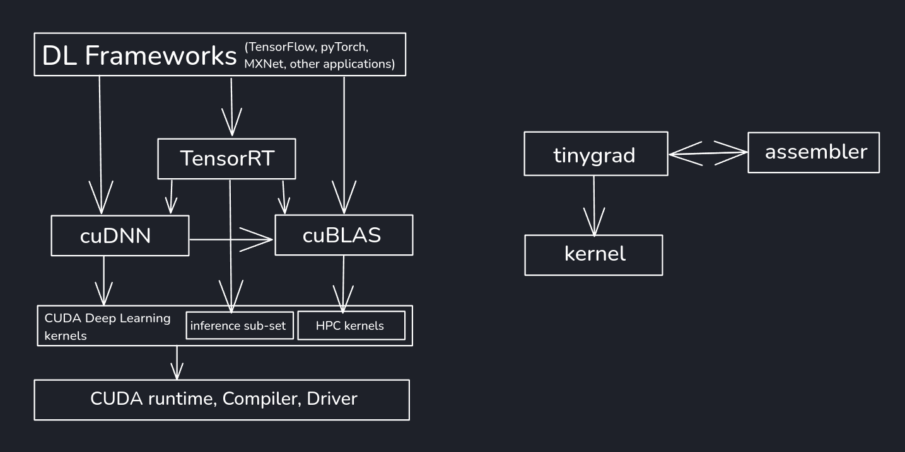

# tinygrad documentation

Welcome to the docs for tinygrad. This page is for users of the tinygrad library. tinygrad is not 1.0 yet, but it will be soon. The API has been pretty stable for a while.

While you can `pip install tinygrad`, we encourage you to install from source:

```bash
git clone https://github.com/tinygrad/tinygrad.git
cd tinygrad
python3 -m pip install -e .
```

After you have installed tinygrad, try the [MNIST tutorial](mnist.md).

If you are new to tensor libraries, learn how to use them by solving puzzles from [tinygrad-tensor-puzzles](https://github.com/obadakhalili/tinygrad-tensor-puzzles).

We also have [developer docs](developer/developer.md), and Di Zhu has created a [bunch of tutorials](https://mesozoic-egg.github.io/tinygrad-notes/) to help understand how tinygrad works.

## tinygrad Usage

The main class you will interact with is [Tensor](tensor/index.md). It functions very similarly to PyTorch, but has a bit more of a functional style. tinygrad supports [many datatypes](dtypes.md).  All operations in tinygrad are lazy, meaning they won't do anything until you realize.

* tinygrad has a built in [neural network library](nn.md) with some classes, optimizers, and load/save state management.
* tinygrad has a JIT to make things fast. Decorate your pure function with `TinyJit`
* tinygrad has amazing support for multiple GPUs, allowing you to shard your Tensors with `Tensor.shard`

To understand what training looks like in tinygrad, you should read `beautiful_mnist.py`

We have a [quickstart guide](quickstart.md) and a [showcase](showcase.md)

## tinygrad Stack



## Differences from PyTorch

If you are migrating from PyTorch, welcome. Most of the API is the same. We hope you will find tinygrad both familiar and somehow more "correct feeling"

### tinygrad doesn't have nn.Module

There's nothing special about a "Module" class in tinygrad, it's just a normal class. [`nn.state.get_parameters`](nn.md/#tinygrad.nn.state.get_parameters) can be used to recursively search normal classes for valid tensors. Instead of the `forward` method in PyTorch, tinygrad just uses `__call__`

### tinygrad is functional

In tinygrad, you can do [`x.conv2d(w, b)`](tensor/ops.md/#tinygrad.Tensor.conv2d) or [`x.sparse_categorical_crossentropy(y)`](tensor/ops.md/#tinygrad.Tensor.sparse_categorical_crossentropy). We do also have a [`Conv2D`](nn.md/#tinygrad.nn.Conv2d) class like PyTorch if you want a place to keep the state, but all stateless operations don't have classes.

### tinygrad is lazy

When you do `a+b` in tinygrad, nothing happens. It's not until you [`realize`](tensor/properties.md#tinygrad.Tensor.realize) the Tensor that the computation actually runs.

### tinygrad requires @TinyJit to be fast

PyTorch spends a lot of development effort to make dispatch very fast. tinygrad doesn't. We have a simple decorator that will replay the kernels used in the decorated function.
