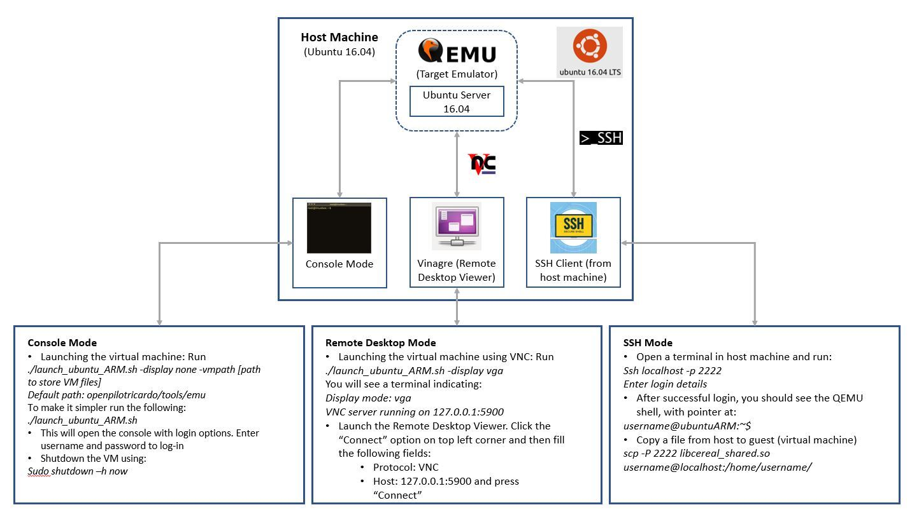
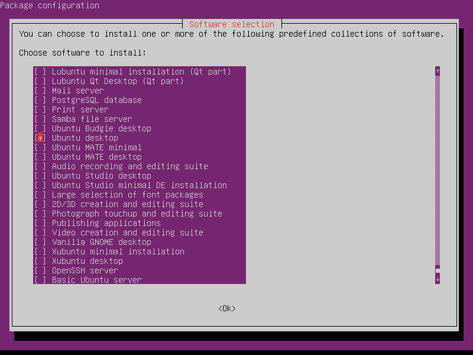
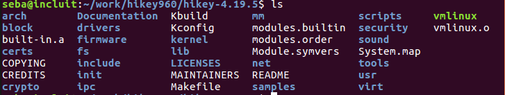
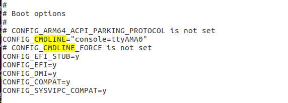
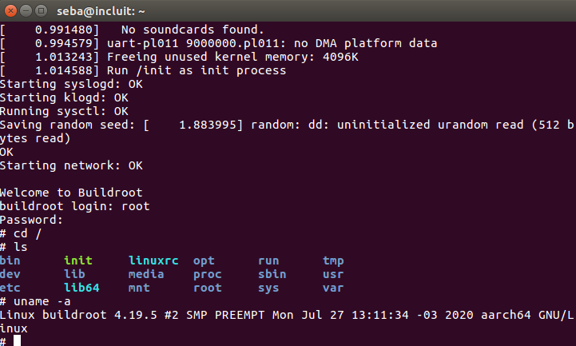

QEMU Setup and VM creation
=======================
This README covers instructions for the following topics:

* [QEMU Installation](#qemu-installation)
* [Ubuntu Server for ARM Install and Configuration](#ubuntu-server-for-arm-install-and-configuration)
  * Console Mode
  * Remote Desktop connection through VNC
  * SSH connection
  This schematic shows the above mentioned modes of accessing the QEMU environment
  
  After completing all the installations as per the sections below, the attached powerpoint will serve as a [cheatsheet](./images/QEMU_and_Ubuntu_Setup_Updated.pdf) for individual mode of login.

* [ARM Virtual Machine cross-compiling the Linux Kernel + Buildroot](#arm-virtual-machine-cross-compiling-the-linux-kernel-+-buildroot)

# QEMU Installation

Installing QEMU on host machine
----------

* First install the default qemu and qemu-efi available as apt package.

```bash
sudo apt install qemu
sudo apt install qemu-efi
```

* Then, get the latest stable QEMU, configure and build it.

```bash
git clone https://github.com/qemu/qemu.git
cd qemu/
mkdir build
cd build/
../configure --target-list=arm-softmmu,aarch64-softmmu && make -j8
```

* After building you can create a symbolic link into /usr/bin

```bash
sudo ln -s <path_to_qemu>/build/aarch64-softmmu/qemu-system-aarch64 /usr/bin/qemu-system-aarch64_5.0
```

# Ubuntu Server for ARM Install and Configuration

## Console Mode

### Ubuntu Server for ARM Installation

- Execute ```install_ubuntu_ARM.sh``` (location: openpilot/tools/emu) and follow the wizard (please see the following [pdf](./images/QEMU_with_Ubuntu_setup.pdf) for detailed steps)

```bash
cd /openpilot/tools/emu
./install_ubuntu_ARM.sh
```
usage

```bash
Usage: ./install_ubuntu_ARM.sh [-vmpath [path to store VM files]]

Optional arguments:
  -vmpath     specifies the path where .img and qcow2 files will be stored. Current working dir by default
```

- QEMU parameters used:

```bash
qemu-system-aarch64_5.0 \
  -cpu cortex-a57 \
  -device virtio-scsi-device \
  -device scsi-cd,drive=cdrom \
  -device virtio-blk-device,drive=hd0 \
  -drive "file=${iso},id=cdrom,if=none,media=cdrom" \
  -drive "if=none,file=${img_snapshot},id=hd0" \
  -m 4G \
  -machine virt \
  -nographic \
  -pflash "$flash0" \
  -pflash "$flash1" \
  -smp 4 \
  -device virtio-net-device,netdev=hostnet0,mac=3c:a0:67:3e:fe:72 \
  -netdev user,id=hostnet0,hostfwd=tcp::2222-:22 \
;
```
here flash0 and flash1 stores the UEFI and its configs.

- Once the installation is completed:
  * log in with the user and password configured
  * shutdown it using ```sudo shutdown -h now``` 
  
### Launching Ubuntu Server 16.04 in QEMU

After finishing the installation you can launch the virtual machine by running ```launch_ubuntu_ARM.sh```. 

Here the parameters used for QEMU are almost the same but you can choose whether to boot in console mode (-nographic) or with VGA support (through a VNC connection):

```bash
Usage: ./launch_ubuntu_ARM.sh [-diplay [none|vga] -vmpath [path to store VM files]]

Optional arguments:
  -display    specifies the display mode. Possible values are: none (default),
              vga (requires a VNC connection).
  -vmpath     specifies the path where .img and qcow2 files will be stored. Current working dir by default
```

```bash
qemu-system-aarch64_5.0 \
  -cpu cortex-a57 \
  -device virtio-blk-device,drive=hd0 \
  -drive "if=none,file=${img_snapshot},id=hd0" \
  -m 4G \
  -machine virt \
  -pflash "$flash0" \
  -pflash "$flash1" \
  -smp 4 \
  -device virtio-net-device,netdev=hostnet0,mac=3c:a0:67:3e:fe:72 \
  -netdev user,id=hostnet0,hostfwd=tcp::2222-:22 \
  -device usb-ehci -device usb-kbd -device usb-mouse -usb \
  -device usb-tablet \
  -device cirrus-vga \
  -vga std \
;
```
If the parameter `-display` is not specified, the Vm will launch in console mode

### Ubuntu Desktop installation

1- Launch the VM (in console mode: Refer to Slide 2 [here](./images/QEMU_and_Ubuntu_Setup_Updated.pdf)) and after logging in install the following:

  a. Select a Display Manager
    
  - To install SLiM:
    ```sudo apt-get install slim```

  - To install LightDM:
    ```sudo apt-get install lightdm```

  b. Install GNOME

  - Start by launching tasksel:
    ```tasksel```

 Use the arrow key to scroll down the list and find Ubuntu desktop

 

 The system will install the software and reboot.

## Remote Desktop connection through VNC

To launch the VM using VNC, run: 

```bash
./launch_ubuntu_ARM.sh -display vga

```

You will see the following message:

```bash

 Display mode: vga 
 VM Installation dir: /home/seba/OS Images 

WARNING: Image format was not specified for '/home/seba/OS Images/ubuntu-16.04.6-server-arm64-flash0.img' and probing guessed raw.
         Automatically detecting the format is dangerous for raw images, write operations on block 0 will be restricted.
         Specify the 'raw' format explicitly to remove the restrictions.
WARNING: Image format was not specified for '/home/seba/OS Images/ubuntu-16.04.6-server-arm64-flash1.img' and probing guessed raw.
         Automatically detecting the format is dangerous for raw images, write operations on block 0 will be restricted.
         Specify the 'raw' format explicitly to remove the restrictions.
VNC server running on 127.0.0.1:5900
```
The virtual machine is being initialized but the output is being sent to the VNC Server. Now open a new terminal and install vinagre as instructed below.

### VNC Connection

- Install vinagre 
  - ```sudo apt install vinagre```

- Launch the Remote Desktop Viewer (Refer to Slide 3 [here](./images/QEMU_and_Ubuntu_Setup_Updated.pdf))
  - Connect to ```127.0.0.1:5900``` -> QEMU shows this when it is launched 

You will see the QEMU environment in a graphical interface. 

## SSH Connection and file sharing

**Guess side - Virtual Machine**
- Log in the VM and Install OpenSSH-server i.e., open qemu in console mode (Refer to Slide 2 [here](./images/QEMU_and_Ubuntu_Setup_Updated.pdf)), login and run the following:

  ```sudo apt install openssh-server```

**Connection from host**
- Open a terminal and type ```ssh localhost -p 2222``` (port 2222 is the one defined in the QEMU parameters)
You will be prompt for credentials:
  
  ```bash
  ssh localhost -p 2222
  username@localhost's password: 
  ```

After successfully loggin in you should see something like this:

  ```bash
  username@localhost's password: 
  Welcome to Ubuntu 16.04.6 LTS (GNU/Linux 4.4.0-186-generic aarch64)

  * Documentation:  https://help.ubuntu.com
  * Management:     https://landscape.canonical.com
  * Support:        https://ubuntu.com/advantage

  * Are you ready for Kubernetes 1.19? It's nearly here! Try RC3 with
    sudo snap install microk8s --channel=1.19/candidate --classic

    https://www.microk8s.io/ has docs and details.

  4 packages can be updated.
  0 updates are security updates.

  New release '18.04.4 LTS' available.
  Run 'do-release-upgrade' to upgrade to it.


  Last login: Tue Aug  4 18:10:23 2020
  username@ubuntuARM:~$ 
  ```

**Copy a file from host to guess (virtual machine)**

  - ```scp -P 2222 libcereal_shared.so <username>@localhost:/home/<username>/```


# ARM Virtual Machine cross-compiling the Linux Kernel + Buildroot

**BUILDROOT**

* In your host machine, download the latest tarball file from here: https://buildroot.org/downloads/buildroot-2020.02.4.tar.gz

* Extract the content and do the following:
```bash
cd buildroot-2020.02.4
make menuconfig
```
* Follow the steps shown in the guide [here](./images/Buildroot_ConfigurationSteps.pdf) to complete the configuration.

* After finishing the build configuration move to kernel cross-compilation below.

**Kernel cross-compilation**
- Get the linux code:
  - I got it from: https://github.com/hanpfei/hikey960-linaro-linux-kernel.git
  - You can also get the latest stable tarball from www.kernel.org

- Extract the content and go inside the kernel folder



- Each architecture has it own configuration file
  - Inside ```arch/arm64/configs``` and you will see the default configuration called ```defconfig```. We need to tell the kernel to boot using this config... but we are not going to change anything here.

- Kernel configuration: Enter the hikey-4.19.5 folder

```bash
#run

ARCH=arm64 CROSS_COMPILE=aarch64-linux-gnu- make defconfig

*** Default configuration is based on 'defconfig'
#
# configuration written to .config
#
```

- After this edit the .config generated: within the current directory run ```gedit .config```
  - search for CMDLINE inside "Boot Options" and add ttyAMA0

  

  - search for INITRAMFS and set the rootfs.cpio generated with buildroot

  


- Kernel compilation

```bash
ARCH=arm64 CROSS_COMPILE=aarch64-linux-gnu- make -j8
```


**Launch a VM using QEMU**

- Launch QEMU by specifying the just cross-compiled kernel

```bash
qemu-system-aarch64_5.0 \
-machine virt \
-cpu cortex-a57 \
-M virt \
-m 4096 \
-kernel /home/srv/Work/Projects/hikey960-linaro-linux-kernel/arch/arm64/boot/Image \
-append "console=ttyAMA0" \
-nographic \
;
```
- Use log in details setup during build configuration and you will see the home as below.


